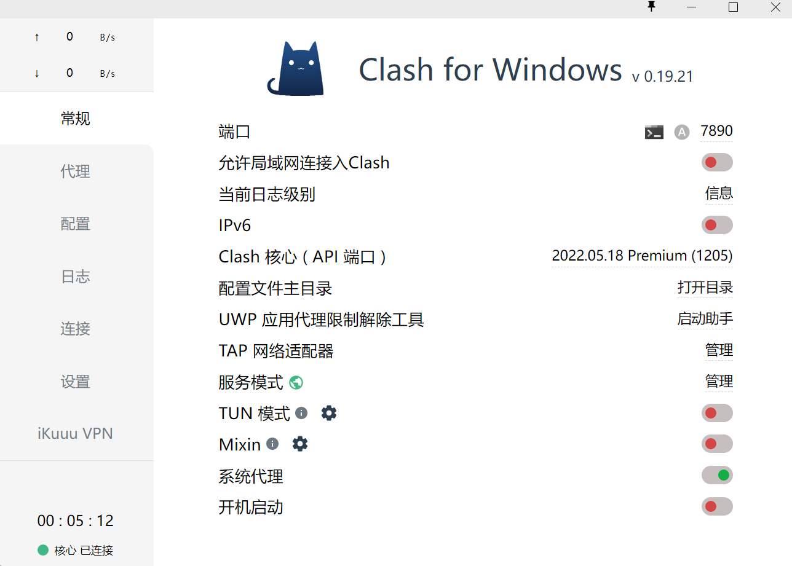

# 配置Git代理

## 查看代理端口

开启代理软件后，查看其开放的端口，例如clash默认为7890



## 配置代理

配置git的代理， `--global` 表示为全局配置

```shell
git config --global http.proxy http://127.0.0.1:7890
git config --global https.proxy http://127.0.0.1:7890
```

## 取消代理

```shell
git config --global --unset http.proxy
git config --global --unset https.proxy
```

